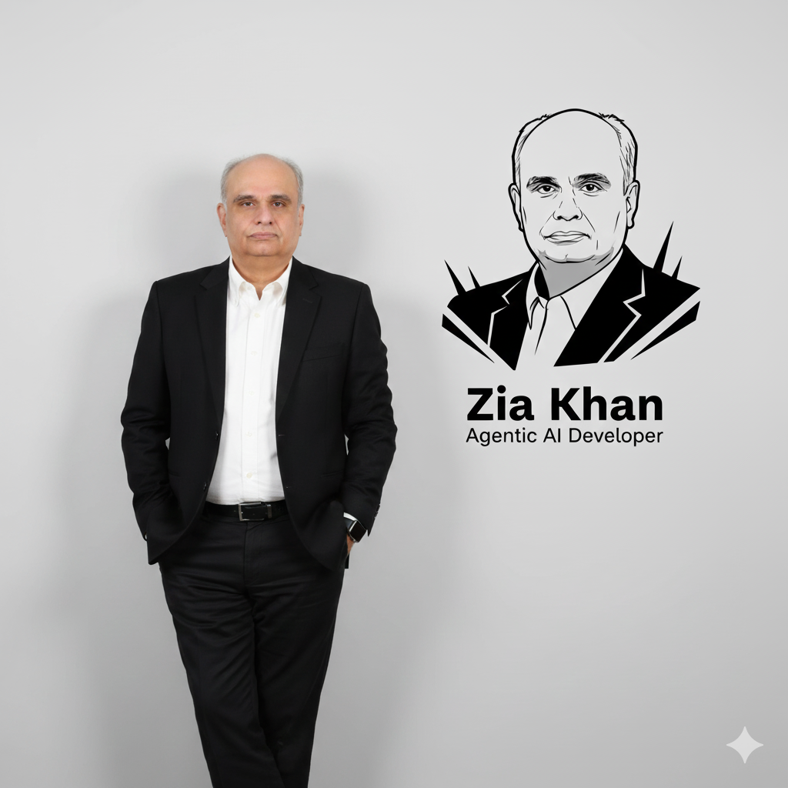
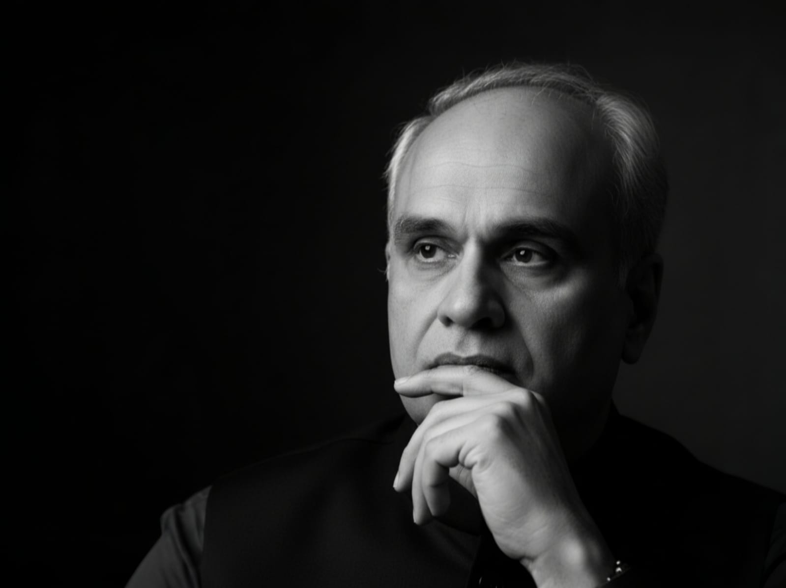
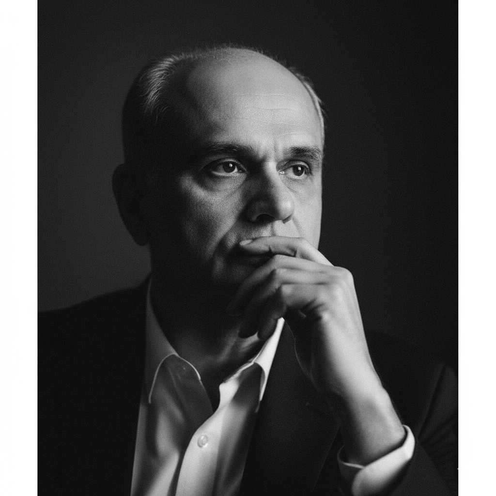
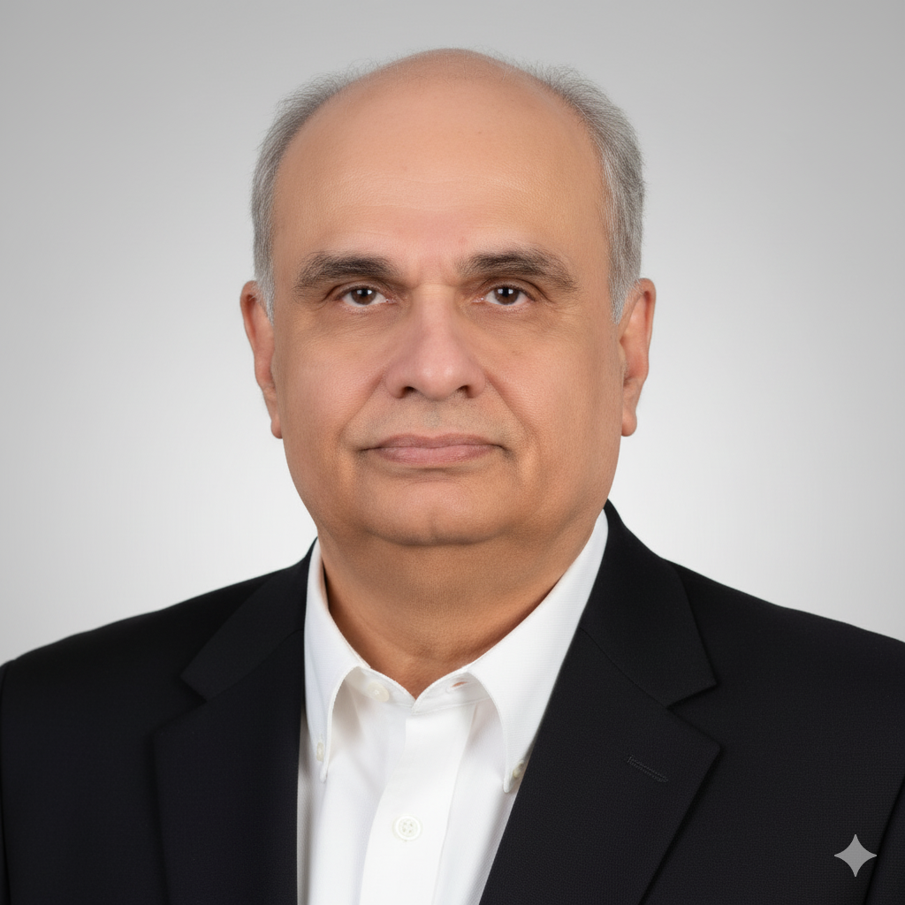
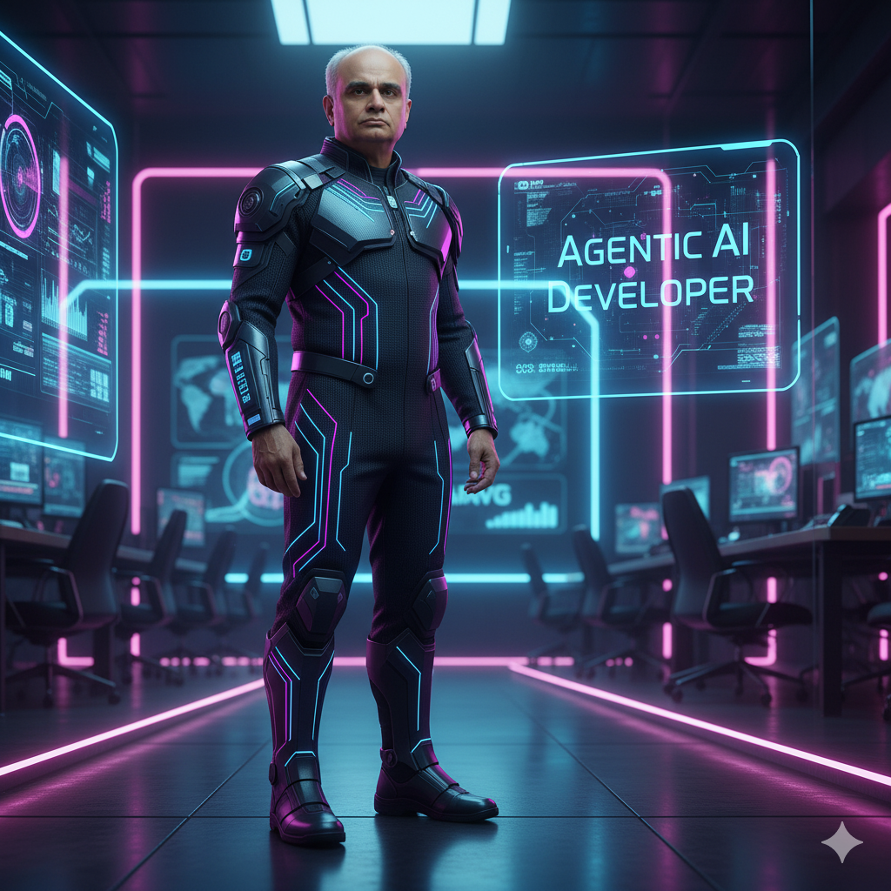
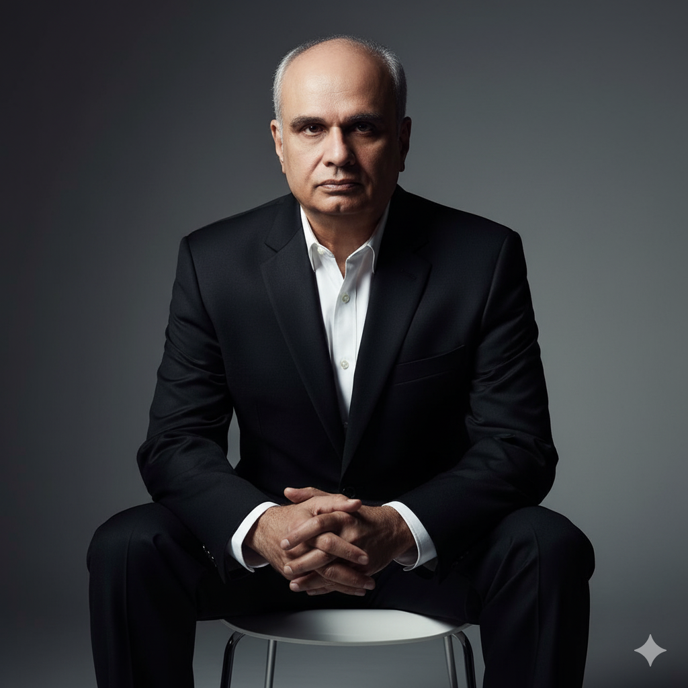
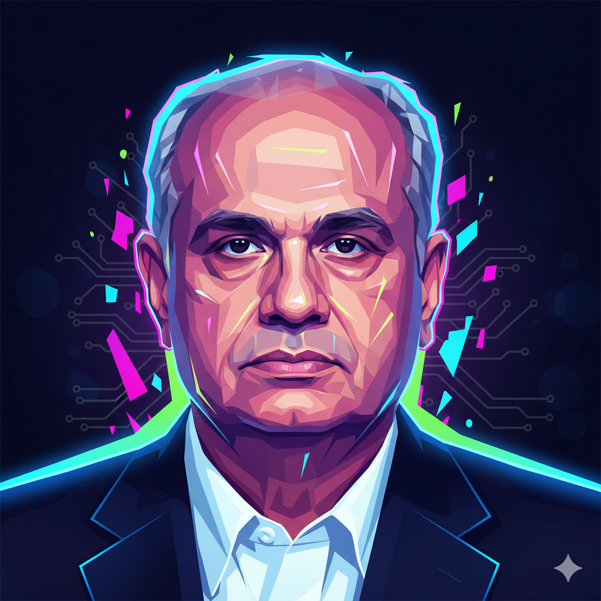

# Prompt Engineering Tutorial for Nano Banana

*By Example — with Real Prompts and Outputs*

Prompt at https://gemini.google.com/

Google Nano Banana (like MidJourney, DALL·E, or Stable Diffusion) responds to highly descriptive prompts. The more structured, visual, and contextual your input, the closer the output matches your intent.

[10 Best Google Gemini Ai Photo Editing Prompts For Men To Create 4k Hd Portraits](https://neolifehospital.in/10-best-google-gemini-ai-photo-editing-prompts-for-men/)

[Top 30 New Trending Gemini AI Photo Editing Prompts for Girl's: Viral Selfie Ideas 2025](https://www.freejobalert.com/article/new-trending-gemini-ai-photo-editing-prompts-for-girls-19256)

---

## Core Principles

### 1. **Specificity Over Generality**
- Vague: "a nice portrait"
- Better: "hyper-realistic studio portrait with professional lighting"

### 2. **Visual Hierarchy**
- Start with the main subject
- Add environment/background
- Specify lighting and mood
- Include technical details

### 3. **Professional Photography Language**
- Use camera terminology (85mm lens, f/1.4, shallow depth of field)
- Reference lighting setups (Rembrandt lighting, studio lighting)
- Mention photography styles (editorial, cinematic, fine art)

## Anatomy of Effective Prompts

A well-structured prompt typically includes:
1. **Subject Description** (who/what)
2. **Pose/Action** (body language, positioning)
3. **Environment** (background, setting)
4. **Lighting** (type, direction, mood)
5. **Style** (aesthetic, genre)
6. **Technical Specifications** (camera settings, composition)
7. **Mood/Atmosphere** (emotional tone)

---

## 🔹 Example 1: Professional Branding Portrait

**Prompt Used:**

<div style="width: 200px; border: 1px solid black; padding: 10px;">
Hyper-realistic full-body portrait of the uploaded photo, standing casually against a smooth light-gray wall. The outfit is as worn as in winter. The hands are inside the pockets, the left hand wears a square smartwatch, one leg casually crossed over the other, relaxed and confident posture. The lighting is a professional studio, bright yet soft, premium clarity.

On the wall beside him is a bold black-and-white stylized vector portrait of the same subject, rendered with modern geometric accents. Beneath the graphic, add clean bold text 'Zia Khan' in large type, and below it is a smaller font 'Agentic AI Developer'

Mood & Style: modern, minimalistic, premium personal-branding aesthetic, sharp contrast, sleek composition.

</div>

Original Image:


Generated:



✅ **What Worked Here**

* **Subject grounding**: “of the uploaded photo” ensures consistency.
* **Pose instructions**: “hands inside the pockets, leg casually crossed” avoids random posture.
* **Context & setting**: “smooth light-gray wall, professional studio lighting” makes it brand-safe.
* **Extra elements**: vector portrait + typography = personal brand identity.

💡 **Takeaway Rule:** *For branding prompts, combine subject grounding + posture + context + design elements (like logos or text).*

---

## 🔹 Example 2: Cinematic Black & White Portrait

**Prompt Used:**

<div style="width: 200px; border: 1px solid black; padding: 10px;">
{
  "prompt": "create moody black and white portrait of a man, hand resting near mouth, deep gaze into distance, dramatic shadows across his face, expressive wrinkles, soft rembrandt  light from the side, cinematic atmosphere, professional portrait photography style, shot on 85mm lens f/1.4, shallow depth of field, high contrast, fine art photography, editorial feel",
  "style": "cinematic, moody, introspective",
  "lighting": "soft side lighting, high contrast shadows, natural light imitation",
  "camera": {
    "Model": "Leica SL2-S",
    "lens": "85mm",
    "aperture": "f/1.4",
    "depth_of_field": "shallow",
    "angle": "close-up portrait, slightly off-center framing"
  },
  "mood": "thoughtful, reflective, timeless"
}
</div>

or 

<div style="width: 200px; border: 1px solid black; padding: 10px;">
create moody black and white portrait of a man, hand resting near mouth, deep gaze into distance, dramatic shadows across his face, expressive wrinkles, soft rembrandt light from the side, cinematic atmosphere, professional portrait photography style, shot on 85mm lens f/1.4, shallow depth of field, high contrast, fine art photography, editorial feel
</div>


**Style Metadata:**

* Style: cinematic, moody, introspective
* Lighting: soft side lighting, high contrast shadows
* Camera: Leica SL2-S, 85mm f/1.4, shallow DoF
* Mood: thoughtful, reflective, timeless

Generated:





✅ **What Worked Here**

* **Mood anchoring**: “moody, cinematic, introspective” frames the emotional tone.
* **Photography realism**: camera & lens details simulate professional photography.
* **Lighting control**: “Rembrandt light” + “high contrast” = timeless look.

💡 **Takeaway Rule:** *For artistic portraits, describe mood, lighting style, and camera lens to mimic photography realism.*

---

## 🔹 Example 3: Corporate Headshot

**Prompt:**

<div style="width: 200px; border: 1px solid black; padding: 10px;">
Professional corporate headshot of a confident middle-aged man, wearing a tailored dark suit and white shirt, subtle smile, neutral blurred background, evenly lit with soft studio lights, sharp focus on the face, natural skin tones, minimal retouching, LinkedIn profile photo style.
</div>

Generated:




✅ **Why This Works:**
It creates a clean, realistic image suitable for resumes, LinkedIn, or official documents.

---

## 🔹 Example 4: Futuristic Branding Poster

**Prompt:**

<div style="width: 200px; border: 1px solid black; padding: 10px;">
Full-body futuristic portrait of the uploaded subject, standing in a sleek cyberpunk office with neon blue and purple accents. Outfit transformed into a smart-tech suit with glowing circuits along the fabric. Holographic display beside him showing the words: 'Agentic AI Developer'. Style: cinematic, glossy, high-tech corporate branding aesthetic.
</div>

💡 **Use Case:** Great for AI events, keynotes, or futuristic branding material.


Generated:



---

## 🔹 Example 5: Magazine Editorial Style

**Prompt:**

<div style="width: 200px; border: 1px solid black; padding: 10px;">
Editorial fashion portrait of a man sitting on a modern chair, dressed in a sharp black suit with no tie, intense gaze into the camera. Lighting dramatic with deep shadows and highlights, glossy magazine style, Vogue photography, minimal background with gradient tones, cinematic 50mm lens effect.
</div>

💡 **Use Case:** Stylish professional portfolios or publications.

Generated:



---

## 🔹 Example 6: Abstract Creative Variant

**Prompt:**

<div style="width: 200px; border: 1px solid black; padding: 10px;">
Digital abstract vector art of the uploaded subject, face geometrically stylized with sharp angular lines, vibrant neon gradient colors, glowing outlines, futuristic tech-hero aesthetic, suitable for modern branding and event posters.
</div>

💡 **Use Case:** Event banners, creative keynote posters, or website hero images.

Generated:



---

# 📝 Best Practices for Prompt Engineering in Nano Banana

1. **Anchor the Subject**

   * Always mention: *“of the uploaded photo”* to retain likeness.

2. **Control the Scene**

   * Use **environment cues**: background, wall, lighting, props.

3. **Specify Style & Mood**

   * Example moods: cinematic, corporate, fine art, futuristic.

4. **Borrow from Photography**

   * Camera/lens terms like *85mm f/1.4* create realism.
   * Lighting terms like *Rembrandt, softbox, backlight* help shape mood.

5. **Add Branding Elements**

   * Vector logos, text overlays, geometric accents.

6. **Iterate in Layers**

   * Start broad (*“corporate portrait”*), then refine with poses, props, typography.

---

## Advanced Techniques

### 1. Layered Lighting Descriptions
```
Primary: soft key light from camera left
Secondary: subtle fill light to reduce shadows
Accent: rim light from behind for separation
Ambient: warm studio ambiance, controlled spill
```

### 2. Composition Rules
```
Rule of thirds placement, subject positioned at left intersection
Leading lines from architectural elements
Negative space on right side for text overlay
Shallow depth of field with bokeh background blur
```

### 3. Color Psychology Integration
```
Warm golden hour tones for approachability
Cool blue shadows for professionalism
High contrast black and white for timeless elegance
Muted earth tones for organic, natural feel
```

## Style Categories

### Corporate/Professional
<div style="width: 200px; border: 1px solid black; padding: 10px;">
Executive portrait: sharp business attire, confident posture, neutral background, even lighting, shot with 85mm lens, shallow depth of field, professional headshot style, clean composition, corporate environment
</div>

### Creative/Artistic
<div style="width: 200px; border: 1px solid black; padding: 10px;">
Artist portrait: creative workspace background, natural lighting from large window, relaxed casual attire, hands engaged with creative tools, environmental storytelling, documentary photography style, 35mm lens, authentic candid moment
</div>

### Fashion/Editorial
<div style="width: 200px; border: 1px solid black; padding: 10px;">
High-fashion portrait: dramatic pose, designer clothing, studio backdrop with gradient lighting, professional hair and makeup, editorial magazine style, shot with medium format camera, sharp details, fashion photography aesthetic
</div>

### Lifestyle/Personal Branding
<div style="width: 200px; border: 1px solid black; padding: 10px;">
Lifestyle portrait: modern home office setting, natural window light, smart casual attire, confident yet approachable expression, environmental context showing personality, lifestyle photography style, authentic moment capture
</div>

## Common Mistakes to Avoid

### ❌ Too Vague
**Bad:** "nice portrait of a person"
**Good:** "professional headshot with studio lighting and neutral background"

### ❌ Conflicting Styles
**Bad:** "vintage film aesthetic with modern digital clarity"
**Good:** "vintage-inspired styling with modern professional photography techniques"

### ❌ Overcomplicating
**Bad:** "surreal artistic avant-garde experimental abstract conceptual portrait"
**Good:** "creative portrait with artistic lighting and thoughtful composition"

### ❌ Missing Key Elements
**Bad:** "person standing"
**Good:** "confident business professional standing against clean white background, professional studio lighting, corporate headshot style"

## Best Practices

### 1. Use Reference Photography Terms
- **Studio lighting:** key light, fill light, rim light, background light
- **Natural lighting:** golden hour, blue hour, window light, overcast
- **Moods:** dramatic, soft, high-key, low-key, moody, bright and airy

### 2. Specify Camera Equipment When Needed
```
Shot with professional DSLR camera
85mm portrait lens for flattering compression
f/2.8 aperture for subject separation
ISO 100 for maximum image quality
```

### 3. Include Environmental Context
```
Modern corporate office environment
Clean white seamless backdrop
Urban rooftop with city skyline
Natural outdoor setting with soft shadows
```

### 4. Layer Your Descriptions
Start broad, then add specifics:
1. Subject type: "Professional business portrait"
2. Add specifics: "of a confident executive"
3. Include environment: "in a modern office setting"
4. Specify lighting: "with soft natural window light"
5. Add technical: "shot with 85mm lens, shallow depth of field"
6. Define mood: "conveying leadership and approachability"

### 5. Use Structured Formatting

**Method 1: Paragraph Style**

<div style="width: 200px; border: 1px solid black; padding: 10px;">
Professional corporate headshot of a business executive, standing confidently in a modern office environment. Clean business attire, direct eye contact with camera, subtle smile conveying approachability. Soft natural lighting from large office windows, complemented by subtle fill lighting. Shot with 85mm lens at f/2.8 for subject separation. Modern, clean aesthetic with neutral color palette. High-end corporate photography style.
</div>

**Method 2: Categorized Style**

<div style="width: 200px; border: 1px solid black; padding: 10px;">
SUBJECT: Corporate executive, professional attire
POSE: Standing confidently, direct eye contact, subtle smile
ENVIRONMENT: Modern office, clean professional setting
LIGHTING: Soft natural window light with fill lighting
CAMERA: 85mm lens, f/2.8 aperture, shallow depth of field
STYLE: High-end corporate photography, clean modern aesthetic
MOOD: Confident, approachable, professional leadership
</div>

**Method 3: JSON Structure** (for complex requirements)

```json
{
  "subject": "professional business portrait",
  "pose": "confident standing position, direct gaze",
  "environment": "modern corporate office",
  "lighting": {
    "primary": "soft natural window light",
    "secondary": "subtle fill lighting"
  },
  "camera": {
    "lens": "85mm",
    "aperture": "f/2.8",
    "style": "professional headshot"
  },
  "mood": "confident, approachable, executive presence"
}
```

## Advanced Example Templates

### Template 1: Corporate Executive

<div style="width: 200px; border: 1px solid black; padding: 10px;">
Professional executive portrait: [SUBJECT] in sharp business attire, standing confidently with hands [HAND_POSITION], direct eye contact conveying [MOOD]. Modern corporate environment with [BACKGROUND_DETAIL]. Studio lighting setup with soft key light from camera left, subtle fill light, rim lighting for separation. Shot with 85mm portrait lens at f/2.8, shallow depth of field. High-end corporate photography style, clean composition, neutral professional color palette.
</div>

### Template 2: Creative Professional

<div style="width: 200px; border: 1px solid black; padding: 10px;">
Creative professional portrait: [SUBJECT] in [ATTIRE_STYLE], positioned [POSE] in [CREATIVE_ENVIRONMENT]. Natural lighting from [LIGHT_SOURCE], creating [LIGHT_QUALITY] illumination. Environmental storytelling elements including [PROPS/CONTEXT]. Documentary photography style with [LENS_TYPE], capturing authentic [MOMENT/EXPRESSION]. Color palette of [COLORS] to reflect [BRAND/PERSONALITY].
</div>

### Template 3: Lifestyle/Personal Brand

<div style="width: 200px; border: 1px solid black; padding: 10px;">
Lifestyle portrait: [SUBJECT] in [SETTING], wearing [CASUAL_ATTIRE], engaged in [ACTIVITY/POSE]. Natural [TIME_OF_DAY] lighting creating [MOOD], shot in [LOCATION_TYPE]. [CAMERA_SPEC] for [DEPTH_EFFECT]. Lifestyle photography aesthetic focusing on [BRAND_ATTRIBUTES]. Authentic, relatable, [EMOTIONAL_TONE] atmosphere.
</div>

## Quality Control Checklist

Before submitting your prompt, verify:
- [ ] Subject is clearly described
- [ ] Pose/positioning is specific
- [ ] Lighting type and direction are specified
- [ ] Environment/background is detailed
- [ ] Camera/technical specs enhance the vision
- [ ] Mood and style are clearly communicated
- [ ] No conflicting elements
- [ ] Professional photography language is used
- [ ] The prompt flows logically from main subject to details

## Conclusion

Effective prompt engineering for nano banana combines artistic vision with technical precision. By following these principles and studying the examples provided, you'll be able to consistently generate professional-quality portraits that meet your specific requirements. Remember: specificity, structure, and professional photography terminology are your keys to success.

Practice with these templates, adapt them to your needs, and develop your own style of prompt engineering. The more specific and well-structured your prompts, the better your results will be.

# Appendix A: Professional Photography Language Reference

*A Comprehensive Guide to Photography Terminology for AI Image Generation*

## Usage Guidelines for AI Prompts

### Combining Technical Terms

**Example Structure:**
"Professional portrait shot with 85mm lens at f/1.4, creating shallow depth of field with creamy bokeh. Rembrandt lighting setup using softbox as key light, subtle fill light to control shadows."

### Balancing Technical and Creative

- Use 2-3 technical terms per prompt maximum
- Combine with creative descriptors for mood
- Prioritize terms that affect the final aesthetic
- Avoid conflicting technical specifications

### Common Effective Combinations

**Corporate Professional:**
- "85mm lens, f/2.8, even studio lighting, neutral background"

**Artistic Portrait:**
- "Shallow depth of field, dramatic side lighting, black and white, high contrast"

**Environmental Portrait:**
- "35mm lens, natural window light, environmental storytelling, documentary style"

This appendix serves as a reference guide for understanding and effectively using professional photography terminology in both traditional photography and AI image generation prompts.

---

## Camera Equipment & Technical Specifications

### Lenses & Focal Lengths

**Portrait Lenses (85mm-135mm)**
- **85mm lens**: The gold standard for portraits; provides natural perspective with subtle compression
- **105mm lens**: Slightly more compressed than 85mm; excellent for isolating subjects
- **135mm lens**: Maximum compression for dramatic effect; requires more distance from subject

**Standard Lenses (35mm-50mm)**
- **50mm lens**: "Normal" lens that mimics human vision; versatile for environmental portraits
- **35mm lens**: Wider field of view; good for environmental storytelling and context

**Wide Angle Lenses (14mm-35mm)**
- **24mm lens**: Wide perspective; can create dramatic environmental context
- **35mm lens**: Moderate wide angle; includes more environment without distortion

### Aperture Settings (f-stops)

**Wide Apertures (Shallow Depth of Field)**
- **f/1.4**: Maximum background blur (bokeh); extremely shallow focus
- **f/1.8**: Strong subject isolation; creamy background separation
- **f/2.8**: Good separation while maintaining some background context

**Medium Apertures (Balanced Focus)**
- **f/4.0**: Moderate depth of field; good for environmental portraits
- **f/5.6**: Standard portrait aperture; sharp subject with blurred background

**Narrow Apertures (Deep Focus)**
- **f/8.0**: Sharp focus throughout most of the frame
- **f/11**: Maximum sharpness across the entire image

### Camera Types & Formats

**Professional DSLR/Mirrorless**
- **Canon 5D Mark IV**: Full-frame professional camera
- **Sony A7R IV**: High-resolution mirrorless system
- **Nikon D850**: Professional DSLR with exceptional detail

**Medium Format**
- **Hasselblad**: Premium quality with distinctive look
- **Fujifilm GFX**: Modern medium format digital

**Film References**
- **35mm film**: Classic film format with characteristic grain
- **Medium format film**: Larger negative size for superior quality

---

## Lighting Terminology

### Studio Lighting Setup

**Key Light**
- Primary light source illuminating the subject
- Usually positioned 45 degrees from camera axis
- Determines the overall exposure and main shadows

**Fill Light**
- Secondary light that reduces shadow contrast
- Typically softer and less intense than key light
- Positioned opposite the key light

**Rim Light/Hair Light**
- Back light that creates separation from background
- Highlights the edge/outline of the subject
- Creates depth and dimensionality

**Background Light**
- Illuminates the backdrop separately from subject
- Controls background tone and separation
- Can create gradients or even illumination

### Lighting Patterns

**Rembrandt Lighting**
- Classic portrait lighting creating small triangle of light on shadow side of face
- Key light positioned high and to one side
- Creates dramatic, artistic mood

**Butterfly Lighting**
- Light directly in front and above subject
- Creates butterfly-shaped shadow under nose
- Flattering for most face shapes

**Split Lighting**
- Light positioned 90 degrees to side of subject
- Half the face in light, half in shadow
- Creates dramatic, moody effect

**Loop Lighting**
- Slight variation of Rembrandt with softer shadows
- Small shadow loop from nose on cheek
- Natural, flattering look

### Light Quality Descriptions

**Hard Light**
- Direct, undiffused light source
- Creates sharp, defined shadows
- High contrast between highlights and shadows
- Example: Direct sunlight, bare flash

**Soft Light**
- Diffused or bounced light source
- Gradual transition between light and shadow
- Even, flattering illumination
- Example: Overcast sky, softbox, umbrella

**Directional Light**
- Light with clear direction creating modeling
- Reveals form and texture through shadows
- Creates three-dimensional appearance

**Flat Light**
- Even illumination with minimal shadows
- Reduces texture and dimension
- Good for eliminating imperfections

---

## Natural Lighting Conditions

### Time-Based Lighting

**Golden Hour**
- First/last hour of sunlight
- Warm, soft, directional light
- Long shadows and golden color temperature
- Most flattering natural light for portraits

**Blue Hour**
- Period just after sunset/before sunrise
- Even, soft blue-toned light
- No harsh shadows
- Romantic, moody atmosphere

**Overcast**
- Cloudy sky acting as giant softbox
- Even, diffused lighting
- No harsh shadows
- Consistent light throughout day

**Midday Sun**
- Direct overhead sunlight
- Hard, unflattering shadows under eyes and nose
- High contrast
- Generally avoided for portraits

### Direction & Quality

**Window Light**
- Soft, directional natural light
- Size of window affects light quality
- North-facing windows provide consistent light
- Can be modified with curtains or diffusion

**Backlighting**
- Subject between camera and light source
- Creates rim lighting effect
- Can produce lens flare or silhouettes
- Dramatic and atmospheric

**Side Lighting**
- Light coming from subject's side
- Reveals texture and form
- Creates natural shadow patterns
- Good for dramatic portraits

---

## Depth of Field Terminology

### Focus Effects

**Shallow Depth of Field**
- Small area in sharp focus
- Background/foreground heavily blurred
- Created by wide apertures (f/1.4, f/1.8)
- Isolates subject from environment

**Deep Depth of Field**
- Large area in sharp focus
- Background remains recognizable
- Created by narrow apertures (f/8, f/11)
- Good for environmental context

**Bokeh**
- Quality of out-of-focus areas
- Smooth, creamy blur is desirable
- Affected by lens design and aperture shape
- "Good bokeh" = pleasing background blur

**Focus Fall-off**
- Gradual transition from sharp to blurred
- Rate depends on aperture and focal length
- Longer lenses create faster fall-off

---

## Composition & Framing

### Classic Rules

**Rule of Thirds**
- Frame divided into nine equal sections
- Subject positioned at intersection points
- Creates more dynamic composition than centering

**Leading Lines**
- Lines in image that draw eye to subject
- Can be architectural elements, natural features
- Creates depth and guides viewer attention

**Negative Space**
- Empty areas around subject
- Provides breathing room in composition
- Can be used for text overlay in branding

**Framing**
- Using elements to create border around subject
- Windows, doorways, natural elements
- Draws attention to subject

### Portrait-Specific Framing

**Headshot**
- Cropped at shoulders or upper chest
- Focus on face and expression
- Standard for corporate and acting portfolios

**Three-Quarter Length**
- Cropped at mid-thigh or knee
- Shows more body language and pose
- Good balance of subject and environment

**Full-Body**
- Shows entire subject from head to toe
- Includes more environmental context
- Requires careful attention to posing

**Environmental Portrait**
- Subject shown in their natural environment
- Context tells story about person
- Balances subject with surroundings

---

## Photography Styles & Genres

### Commercial Photography

**Corporate Headshots**
- Clean, professional appearance
- Even lighting to minimize shadows
- Neutral backgrounds
- Conservative cropping and composition

**Executive Portraits**
- Authoritative and confident mood
- Higher production value
- Environmental context of success
- Premium lighting and retouching

**LinkedIn Profile Photos**
- Approachable but professional
- Clean background
- Direct eye contact
- Conservative business attire

### Editorial Photography

**Magazine Style**
- High production value
- Creative lighting and composition
- Fashion-forward styling
- Artistic interpretation of subject

**Documentary Style**
- Natural, candid moments
- Environmental storytelling
- Authentic expressions and poses
- Less controlled lighting

**Fashion Photography**
- Emphasis on styling and clothing
- Creative poses and expressions
- High contrast or dramatic lighting
- Artistic composition

### Fine Art Photography

**Portrait Art**
- Artistic interpretation over commercial appeal
- Creative use of light and shadow
- Unique perspectives and compositions
- Emotional or conceptual storytelling

**Black and White**
- Emphasis on form, texture, and contrast
- Timeless, classic aesthetic
- Dramatic lighting effects
- Removes color distractions

---

## Color Temperature & White Balance

### Color Temperature Scale (Kelvin)

**Warm Light (2700K-3200K)**
- Candlelight, tungsten bulbs
- Golden, orange tones
- Cozy, intimate feeling
- Good for romantic or comfortable moods

**Neutral Light (3200K-5500K)**
- Studio strobes, flash
- Balanced, natural skin tones
- Professional standard
- Most flattering for portraits

**Cool Light (5500K-7000K)**
- Daylight, overcast sky
- Blue-white tones
- Clean, modern feeling
- Can appear clinical or professional

**Very Cool Light (7000K+)**
- Shade, blue sky
- Strong blue cast
- Can create mood or technical issues
- Often corrected in post-processing

---

## Post-Processing Terms

### Basic Adjustments

**Exposure**
- Overall brightness of image
- Affects highlights and shadows
- Global adjustment affecting entire image

**Contrast**
- Difference between lightest and darkest areas
- High contrast = dramatic, punchy look
- Low contrast = soft, muted appearance

**Highlights/Shadows**
- Selective adjustment of bright/dark areas
- Recovers detail in blown highlights
- Opens up dark shadow areas

### Advanced Techniques

**Dodge and Burn**
- Selectively lighten (dodge) or darken (burn) areas
- Enhances natural light patterns
- Adds dimension and modeling to face

**Color Grading**
- Adjusting colors for mood and style
- Separate control of highlights/shadows
- Creates signature look or brand consistency

**Skin Retouching**
- Removing blemishes and imperfections
- Smoothing while maintaining texture
- Professional standard varies by use case

---

## Professional Photography Equipment

### Studio Equipment

**Softbox**
- Fabric diffusion panel over light source
- Creates soft, even illumination
- Various sizes for different effects
- Most common studio modifier

**Umbrella**
- Reflective or shoot-through diffusion
- Broader, softer light than direct flash
- Portable and easy to set up
- Less controlled than softbox

**Beauty Dish**
- Large, shallow reflector
- Soft yet directional light
- Popular for fashion and beauty work
- Creates distinctive catch-light pattern

**Grid/Honeycomb**
- Restricts light spread
- Creates more directional beam
- Prevents light spill
- Good for background separation

### Modifiers & Accessories

**Reflector**
- Bounces light back onto subject
- Fills in shadows naturally
- Available in various colors (white, silver, gold)
- Essential for outdoor portraits

**Flag/Gobo**
- Blocks or shapes light
- Creates shadows or negative fill
- Controls light spill
- Professional lighting control

**Diffusion Panel**
- Large translucent material
- Softens harsh sunlight
- Creates even illumination
- Portable solution for location work

---

## Quality Descriptors

### Image Quality Terms

**Tack Sharp**
- Extremely sharp focus
- No motion blur or focus issues
- Professional standard for portraits
- Requires proper technique and equipment

**Creamy Bokeh**
- Smooth, pleasant background blur
- No harsh edges or distracting elements
- Sign of quality lens and proper technique
- Desirable for subject isolation

**Rich Tones**
- Full range of colors and contrast
- No blown highlights or blocked shadows
- Professional color grading
- Premium post-processing quality

**Natural Skin Tones**
- Accurate color reproduction
- Proper white balance
- Flattering but realistic
- Professional standard for portraits

### Professional Standards

**Editorial Quality**
- Magazine-ready production values
- Perfect technical execution
- Creative and engaging composition
- High-end retouching standards

**Commercial Grade**
- Suitable for advertising and marketing
- Consistent brand representation
- Professional lighting and styling
- Polished final presentation

**Fine Art Standard**
- Museum-quality printing and finishing
- Artistic vision and execution
- Unique perspective and interpretation
- Long-term archival considerations

---

