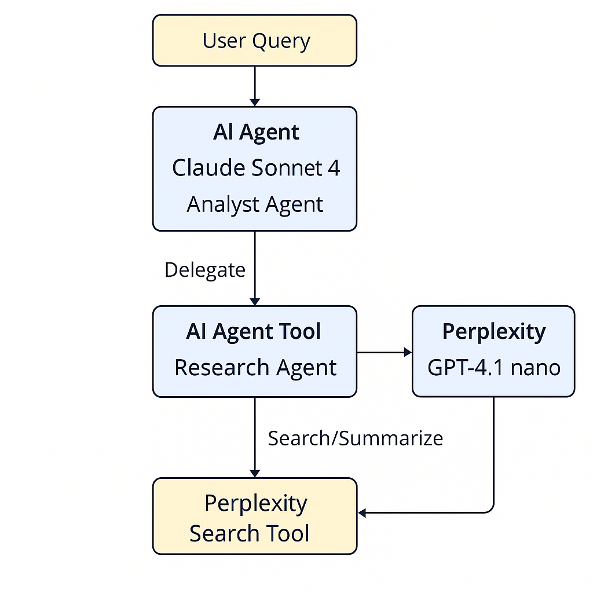

# AI Agents

We will cover these tutorials in class:

### **Step 1: Understand the Fundamentals**

Start by grasping the core concepts behind AI agents. This will give you a solid theoretical foundation before you dive into the practical aspects.

* **[AI Agents Explained: From Theory to Practical Deployment](https://blog.n8n.io/ai-agents/)**: This article will introduce you to the theory of AI agents, their components, and how they can be used.
* **[AI agentic workflows: a practical guide for n8n automation](https://blog.n8n.io/ai-agentic-workflows/)**:
This bridges the gap between theory and n8n-specific implementation. It also gives you real-world automation use cases.

***

### **Step 2: Your First Hands-On Project**

Now that you have the theoretical knowledge, it's time to build your first agent. These resources will give you both a step-by-step guide and a visual demonstration.

* **[Build an AI chat agent with n8n](https://docs.n8n.io/advanced-ai/intro-tutorial/)**: This tutorial will walk you through creating a simple but functional AI chat agent.
* **[AI Agent Node](https://docs.n8n.io/integrations/builtin/cluster-nodes/root-nodes/n8n-nodes-langchain.agent/)*:
Once you’ve built your first agent, dive into the docs for the AI Agent node to understand all its configuration options, so you can tweak and expand beyond the tutorial.
* **[n8n Just Made Multi Agent AI Way Easier: New AI Agent Tool](https://www.youtube.com/watch?v=lW5xEm7iSXk)**: Watch this video to get a visual understanding of the new AI Agent Tool and how it simplifies the process. It's a great companion to the hands-on tutorial. From this video we have created a [Tutorial which is attached](#tutorial-building-multi-agent-ai-workflows-in-n8n-with-the-new-ai-agent-tool)

***

### **Step 3: Dive Deeper into Agentic Workflows**

With a basic agent under your belt, you can now explore the more practical aspects of creating agentic workflows for automation.

* **[AI agentic workflows: a practical guide for n8n automation](https://blog.n8n.io/ai-agentic-workflows/)**: This guide provides practical insights into designing and implementing more complex agentic workflows in n8n.

***

### **Step 4: Introduction to Multi-Agent Systems**

Once you're comfortable with single agents, you can move on to the more advanced topic of multi-agent systems, where multiple agents collaborate to achieve a goal.

* **[Building your first multi-agent system with n8n](https://medium.com/mitb-for-all/building-your-first-multi-agent-system-with-n8n-0c959d7139a1)**: This article will guide you through the process of creating your first multi-agent system.

***

### **Step 5: Advanced and Community-Driven Examples**

To further enhance your skills, explore real-world examples and advanced techniques shared by the n8n community.

* **[How I Built a Multi-Agent AI System in n8n Using Sub-Workflows example](https://community.n8n.io/t/how-i-built-a-multi-agent-ai-system-in-n8n-using-sub-workflows-example/120176)**: This community post offers a detailed walkthrough of a complex multi-agent system using sub-workflows.

***

### **Reference Materials and Templates**

Keep these resources handy as you work through the steps above. They provide detailed information on specific nodes and ready-to-use templates.

* **[AI Agent node](https://docs.n8n.io/integrations/builtin/cluster-nodes/root-nodes/n8n-nodes-langchain.agent/)**: The official documentation for the AI Agent node. Use this as a reference for all the available options and settings.
* **[AI agent chat](https://n8n.io/workflows/1954-ai-agent-chat/)**: A pre-built workflow that you can import and dissect to understand how a chat agent is constructed.

---

You will watch these videos at home:

[How to Build AI Agents: Ultimate Beginner’s Guide](https://www.youtube.com/watch?v=a8NA0WGI9OI)

[Build Anything with GPT-5 and n8n AI Agents](https://www.youtube.com/watch?v=gGCwSIlIRlY)

[n8n Tutorial For Beginners: How To Set Up AI Agents That Save You Hours](https://www.youtube.com/watch?v=RRIgP3Msgqs)

Here’s a detailed tutorial based on the video and transcript you provided. I’ve structured it as a step-by-step guide with explanations, benefits, and practical examples so it’s easy to follow and implement.

---

# **Tutorial: Building Multi-Agent AI Workflows in n8n with the New AI Agent Tool**

The n8n team has released a powerful new feature — the **AI Agent Tool** — allowing you to embed AI agents within other AI agents in the **same workflow**, without relying on separate subworkflows. This opens up possibilities for **multi-agent orchestration** and **cost-efficient model usage**.

---

## **1. Understanding the Old vs. New Approach**

### **Old Way** – Subworkflows

* You’d have your main AI agent workflow (e.g., Analyst Agent).
* To achieve multi-agent behavior, you would call another n8n workflow as a **subworkflow**.
* Benefits:

  * Clear separation of concerns.
  * Good for when the subworkflow isn’t AI-heavy or has its own complex logic.
* Drawbacks:

  * You need to manage two separate workflows.
  * Switching between them to make changes is time-consuming.

### **New Way** – AI Agent Tool

* Now you can use another AI agent **as a tool** inside the same workflow.
* No need for two separate workflow tabs.
* Great for **tight integration** and **token-cost optimization**.

---

## **2. When to Use Multi-Agent Workflows**

* **Cost Optimization:** Use an expensive model (e.g., Claude Sonnet 4) for reasoning and synthesis, and a cheaper model (e.g., GPT-4.1 nano) for data-heavy tasks like research.
* **Specialization:** Different agents handle different roles — e.g., one for research, one for analysis, one for creative writing.
* **Tool-Specific Agents:** Use specialized smaller models for specific tool-calling tasks.

---

## **3. Example: Analyst Agent + Research Agent**

**Scenario:**

* Analyst Agent = Overseer (expensive, high-quality synthesis).
* Research Agent = Worker (cheap, token-heavy queries).

**Step-by-Step Setup:**

### **Step 1 — Create the Parent Analyst Agent**

1. Add an **AI Agent** node in n8n.
2. Set the model to **Claude Sonnet 4** (or your preferred high-quality model).
3. Configure it to:

   * Receive user queries.
   * Decide when to delegate to the Research Agent.

---

### **Step 2 — Add the AI Agent Tool**

1. In the Analyst Agent workflow, click **+** to add a new node.
2. Search for **AI Agent Tool**.
3. Select it and link it to the Research Agent.

---

### **Step 3 — Build the Research Agent**

1. Inside the Research Agent node:

   * Give it a **description** — e.g., “Use this agent for real-world research.”
   * Configure its prompt to accept a query and produce summarized results.
   * Attach the **Perplexity Search Tool** to handle internet searches.
   * Set the model to **GPT-4.1 nano** (cheap and fast).
2. Ensure it:

   * Receives a query from the parent agent.
   * Summarizes findings before sending them back.

---

### **Step 4 — Link the Tools**

* Disconnect Perplexity directly from the Analyst Agent.
* Attach Perplexity to the Research Agent.
* Link the Research Agent as a tool for the Analyst Agent.

---

## **4. Why This Works Well**

* **Token Efficiency:**
  In testing, both single-agent and multi-agent versions consumed \~50,000 tokens. But with multi-agent:

  * Half the tokens were processed by the **37× cheaper model**.
  * Huge cost savings over time.
* **Right Model for the Right Job:**
  Use premium models only where they add the most value.
* **Better Organization:**
  Each agent focuses on its role — reduces confusion and hallucination risk.

---

## **5. Going Multi-Level Deep**

* You can nest AI agents **multiple layers deep** — e.g.:

  * Analyst Agent → Research Agent → Data Extraction Agent.
* n8n reports no degradation in performance so far with multiple layers.

---

## **6. Monitoring & Debugging**

* The **Execution Logs** show:

  * Parent agent activity.
  * Sub-agent calls.
  * Tool usage within sub-agents.
* This helps you trace results and optimize prompts or model choices.

---

## **7. Example Cost Breakdown**

* Analyst Agent (Claude Sonnet 4): 5 calls.
* Research Agent (GPT-4.1 nano): 9 calls.
* Result:
  Heavy token usage handled by a **much cheaper model**.

---

## **8. Tips & Best Practices**

* **Prompt Control:** Add checks and constraints to sub-agents to reduce hallucination.
* **Specialized Models:** Use small, fast open-source models for specific structured outputs or tool calls.
* **Modular Thinking:** Keep agent roles narrow and well-defined.

---

## **9. Wrap-Up**

The **AI Agent Tool** in n8n makes it easier than ever to:

* Build **multi-agent AI workflows** in a single workspace.
* **Save costs** by strategically using models.
* Create **scalable, role-specific AI architectures** without juggling multiple workflow tabs.

> 🚀 **Your Next Step:** Try creating your own specialized agents and see how deep you can go with multi-layer orchestration.

Happy flowgramming!

---

