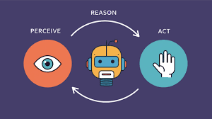
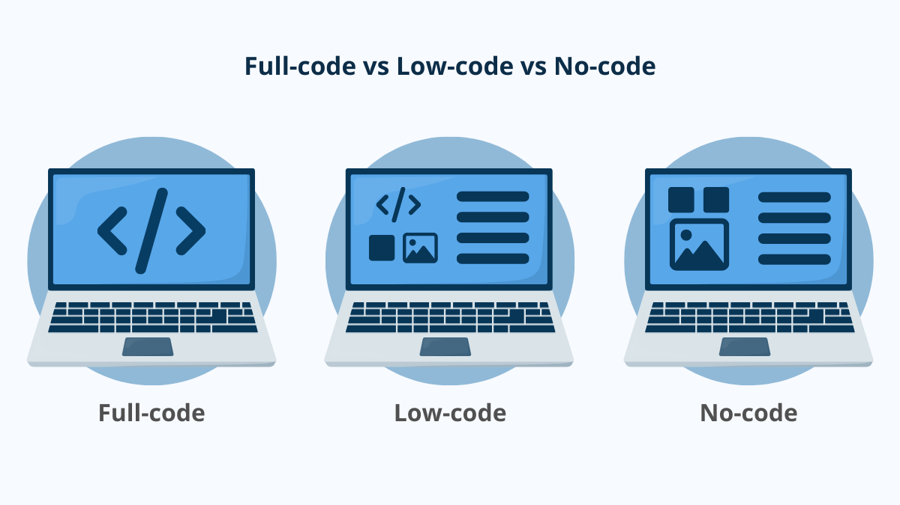

# Agentic AI Development with Low-Code n8n and Model Context Protocol (MCP)

This repo is part of the [Panaversity Certified Agentic & Robotic AI Engineer](https://panaversity.org/) program. You can also review the certification and course details in the [program guide](https://docs.google.com/document/d/1BygAckkfc_NFQnTfEM6qqUvPdlIHpNItmRtvfRMGp38/edit?usp=sharing). This repo provides learning material for n8n course and certification.

For learning Full-Code development refer to this [Learn Agentic AI](https://github.com/panaversity/learn-agentic-ai) repository.

## What is n8n?

**n8n** (pronounced “n-eight-n”) is an open‑source workflow automation, Agentic AI, and orchestration platform. It lets you build AI Agents and connect APIs, databases, and services with a visual, node‑based editor, while still giving you the power to drop into code when you need it. For agentic AI, that combination—**no‑code orchestration with just‑enough code**—makes n8n an ideal control plane for prototyping and building systems that can **perceive, plan, and act** across tools.

[N8n Raises $2.3 Billion in Four Months, Valuation Exponentially Increases](https://www.ainvest.com/news/n8n-raises-2-3-billion-months-valuation-exponentially-increases-2508/)

[n8n vs Python Agentic Frameworks](https://chatgpt.com/share/689ca2f2-1c88-8001-8721-3682c1ca8244)

## What are AI Agents?

An AI agent is a system that doesn’t just answer a prompt—it **perceives, decides, and acts** toward a goal, often over multiple steps and with tools.

[Gartner’s Top 10 Tech Trends Of 2025: Agentic AI and Beyond](https://www.productiveedge.com/blog/gartners-top-10-tech-trends-of-2025-agentic-ai-and-beyond)

# The idea in one line

**LLM (the brain) + tools/APIs (hands) + memory (long-term context) + goals (what to achieve) + a loop (to try, check, and try again).**

## How it’s different from a simple chatbot

* **Chatbot:** single-turn Q\&A.
* **Agent:** multi-step workflow. It can browse data, call APIs, write files, plan next steps, and keep going until a goal condition is met.

## Core pieces

* **Planner/Reasoner:** figures out next best action.
* **Tools/Actuators:** code functions, APIs (email, DB, calendar, web, shell, etc.).
* **Memory/State:** keeps track of what’s done, results, and constraints.
* **Critic/Verifier (optional):** checks outputs, retries or switches strategy.

## Quick examples

* **Inbox triage agent:** reads emails, classifies, drafts replies, schedules meetings.
* **Data analyst agent:** pulls Xero/DB data, cleans it, runs queries, builds a CSV/visual, summarizes findings.
* **DevOps agent:** watches logs, files incidents, rolls back or scales services based on rules.

## When to use an agent

* You need **automation** across several steps or systems.
* The task benefits from **planning** and **feedback** (retrying, verifying).
* You want **hands-off workflows** with occasional human approval.

## Trade-offs

* **Pros:** autonomy, speed, integrates many tools, handles long workflows.
* **Cons:** harder to control/trace, needs guardrails and evals, can incur cost and require careful permissions.

Here’s a clear, beginner-friendly way to see **n8n as an agentic AI platform**—what it is, why it’s useful, and how to start fast.

## What n8n is (in agent terms)

**n8n** is a visual **workflow orchestrator**. You drag-and-drop nodes to let an AI model (the “brain”) use **tools** (APIs, databases, vector stores), manage **memory**, and include **humans** when needed. In other words, you build agents that can perceive → decide → act across your stack. n8n ships AI/LLM nodes (OpenAI, embeddings, chat), tool nodes (HTTP Request, Slack, etc.), and “agent” patterns out of the box.

## Mental model (simple)

1. **Trigger** (manual, schedule, webhook, Slack).
2. **Plan/decide** (LLM node).
3. **Act** (tool nodes like HTTP, DB, Drive, Slack).
4. **Remember** (Chat Memory / vector store).
5. **Verify/HITL** (approval or guardrail step).
6. **Loop** until the goal is met or a stop condition is reached.

## Common use cases for beginners

* **AI helpdesk or chatbot** that reads docs (vector store), answers, and escalates to a human on low confidence. ([n8n Docs][3])
* **Report generator**: fetch API/DB data (HTTP), summarize with LLM, export CSV/XLSX, send to Slack/email with an approval step. ([n8n Docs][6])
* **Research assistant**: scrape pages, chunk & embed to Pinecone/Qdrant, then chat over the corpus. ([n8n Docs][9])

## No-Code, Low-code, and Full-code

Agentic AI platforms can be introduced as a continuum—**no-code**, **low-code**, and **full-code**—that aligns delivery speed with architectural control as solutions mature. **No-code** platforms provide visual builders, templates, and managed connectors so non-developers can assemble agent workflows quickly and safely. **Low-code** platforms retain a visual canvas but add programmable “escape hatches” (custom logic, APIs, components) to handle real-world variability while preserving rapid iteration for internal tools and orchestration. **Full-code** platforms expose full SDKs and runtime control, enabling engineers to implement bespoke agent behaviors, enforce testing and observability, integrate with existing services, and meet performance, security, and compliance requirements. A pragmatic adoption path for developers is to ideate in low-code for fastest validation and prototying,and graduate the durable or business-critical workloads to full-code for long-term reliability and scale.

Here’s a crisp way to tell them apart and know when to use which.

### What they are

* **No-code:** Visual app builders for non-developers—think drag-and-drop UI, built-in data, and “recipes” for logic.
* **Low-code:** Visual + code “escape hatches”—faster than full code, but you can script/extend when needed.
* **Full-code:** Everything is coded by engineers—maximum control, minimum guardrails, longest runway.

### Side-by-side

| Dimension               | No-code                            | Low-code                              | Full-code                                           |
| ----------------------- | ---------------------------------- | ------------------------------------- | --------------------------------------------------- |
| **Primary users**       | Business users, analysts           | Devs + prototypers + power users                    | Software engineers                                  |
| **Speed to MVP**        | Fastest                            | Fast                                  | Slowest                                             |
| **UI/Logic**            | Drag-and-drop + prebuilt actions   | Visual flows + custom code blocks     | Hand-coded UI, APIs, logic                          |
| **Data**                | Built-in tables/connectors         | Connectors + custom integrations      | Any database or data layer you choose               |
| **Extensibility**       | Limited to vendor features         | Plugins, scripts, custom components   | Unlimited (your stack, your rules)                  |
| **DevOps/CI/CD**        | Vendor-managed                     | Partial (some pipelines)              | You own CI/CD, testing, infra                       |
| **Compliance/Gov**      | Varies by vendor                   | Stronger enterprise options           | You design for your needs                           |
| **Scale & performance** | Good for small/medium apps         | Medium→large with tuning              | Any scale (with engineering effort)                 |
| **Vendor lock-in**      | Highest                            | Medium                                | Lowest                                              |
| **Cost profile**        | Per-user/app fees                  | Platform + dev time                   | Infra + engineering time                            |
| **Typical examples**    | Zapier + Airtable + Google Opal | n8n | React/Next.js + FastAPI +  Open AI Agents SDK |

### When to pick which

* **Choose no-code** when non-devs need quick CRUD apps, forms, simple workflows, prototypes, or microsites, and tight deadlines matter more than perfect fit.
* **Choose low-code** when you want speed **and** the option to drop in real code—internal tools, admin consoles, workflow automation, line-of-business apps with a few custom bits.
* **Choose full-code** when you need bespoke UX, complex logic, high performance, strict security/compliance, deep integrations, or plan to scale into a product with a long lifecycle.

### Migration paths (practical strategy)

1. **Prototype in no-code/low-code**, validate workflows/data model.
2. **Rebuild critical paths in full-code** as scale/complexity demands (keep the no/low-code app for back-office ops).

### Where does n8n stand in the spectrum

Short answer: **n8n is firmly “low-code”**—a developer-friendly automation/workflow platform that sits between no-code tools (Zapier and Make) and full-code (Python and OpenAI Agents SDK).

## Why low-code?

* **Visual flows** for 80–90% of logic.
* **Code escape hatches** (Function/Code nodes, expressions) when you need JS/Python, custom auth, or odd transforms.
* **Self-hostable & open source**, so lower vendor lock-in than typical no-code.

In the category as open-source, low-code platforms with agent features, n8n is clearly in the top tier and growing extremely fast.

- n8n’s GitHub stars jumped from 75k on Apr 8, 2025 to 100k by May 28, 2025—a big surge in ~7 weeks. 
- n8n has leaned hard into AI agents (native “AI Agent” node, multi-agent orchestration, docs and templates), so growth is tied to agentic use cases—not just classic automation.

---

## Our Agentic AI Stack: n8n and OpenAI Agents SDK

We’re standardizing on **n8n** for the low-code layer and the **OpenAI Agents SDK** for the full-code layer because both are showing exceptional, category-specific growth, are **open source**, **self-hostable**, and run cleanly in **containers** on **Kubernetes** across any cloud—giving developers a fast visual surface for prototyping and a rigorously testable codebase for production. Critically, both align on the **Model Context Protocol (MCP)**: n8n provides a built-in **MCP Client Tool** node to consume tools from external MCP servers and publishes guidance/templates for exposing n8n workflows as an **MCP server**, enabling the same tool surface in visual automations. On the full-code side, the OpenAI Agents SDK offers first-class MCP support. This shared MCP foundation lets us move prototypes to production with minimal rework: the **same MCP servers** (filesystems, web research, internal APIs, etc.) can be exercised from n8n during rapid iteration and then wired directly into Agents SDK–based services as they harden—keeping interfaces stable while we scale.

Practically, we prototype in n8n to validate data models and agent behaviors, lock down webhook/API contracts, and capture human-in-the-loop steps; then we codify in the Agents SDK for performance, reliability, and compliance, while continuing to use n8n for ops automations and glue. The result is speed where it matters and rigor where it counts—the path from whiteboard to production without reinventing the pen every week.

In short: we bet on the winners in each category to move faster now and scale safely later—speed where it matters.

---

## Comparision of n8n Skills vs OpenAI Agents SDK skills for Enterprise Development, Startups, and Freelancing

Let’s do a **three-way comparison** of **n8n skills** vs **OpenAI Agents SDK skills**, and examine **how useful they are in enterprise development, startups, and freelancing**.

I’ll break it down by **platform skill**, **context**, and **practical impact**.

---

## **1. Enterprise Development**

| Skill             | Usefulness                                                                                                                                                                                | Why It Matters                                                                                                                                                                                                                                            |
| ----------------- | ----------------------------------------------------------------------------------------------------------------------------------------------------------------------------------------- | --------------------------------------------------------------------------------------------------------------------------------------------------------------------------------------------------------------------------------------------------------- |
| **n8n**           | **High** for **process automation** and integrating AI into existing systems with minimal engineering effort. Great for departments like HR, customer service, marketing, and operations. | - Enterprises often have non-technical users who can maintain n8n workflows. - Ideal for connecting LLMs with CRMs, ERPs, ticketing systems. - Quick ROI because of low-code approach. - Can be governed and monitored centrally.                |
| **OpenAI Agents** | **High** for **custom AI solutions deeply embedded into enterprise products**.                                                                                                            | - When AI becomes a **core product feature** rather than an automation add-on. - Allows full customization, security, and integration with complex internal APIs. - Better for high-scale or high-security environments where code control matters. |

**Verdict for Enterprises**:

* **n8n** → Fast departmental solutions, non-critical AI enhancements, rapid prototyping.
* **OpenAI Agents** → Mission-critical AI embedded into products and enterprise architecture.

---

## **2. Startups**

| Skill             | Usefulness                                                | Why It Matters                                                                                                                                                                                                              |
| ----------------- | --------------------------------------------------------- | --------------------------------------------------------------------------------------------------------------------------------------------------------------------------------------------------------------------------- |
| **n8n**           | **Very High** for early-stage MVPs and proof-of-concepts. | - Startups need speed → n8n lets them integrate AI with Stripe, Slack, Notion, and APIs in hours. - Reduces engineering overhead until product-market fit is found. - Can even serve as a backend in early days.      |
| **OpenAI Agents** | **Very High** for scaling from MVP to full product.       | - Once validated, startups need control over **performance, cost, and UX**. - OpenAI Agents enable advanced logic, security, and data handling that low-code tools can’t match. - Better for long-term defensibility. |

**Verdict for Startups**:

* **n8n** → Build the MVP fast, get feedback, raise funding.
* **OpenAI Agents** → Build the scalable, defensible version after validation.

---

## **3. Freelancing**

| Skill             | Usefulness                                                           | Why It Matters                                                                                                                                                                                                          |
| ----------------- | -------------------------------------------------------------------- | ----------------------------------------------------------------------------------------------------------------------------------------------------------------------------------------------------------------------- |
| **n8n**           | **Extremely High** for short-term, high-turnaround projects.         | - Many small businesses can’t afford custom-coded AI solutions. - n8n lets freelancers deliver functional AI workflows in days. - Easier to train clients to maintain it themselves, meaning less support burden. |
| **OpenAI Agents** | **High** but more niche — for higher-ticket, complex freelance gigs. | - Ideal if the client needs **custom AI assistants, multi-agent orchestration, or deep API integrations** beyond what n8n easily supports. - Fewer projects, but higher rates per project.                           |

**Verdict for Freelancing**:

* **n8n** → More clients, faster delivery, high repeat work.
* **OpenAI Agents** → Fewer but bigger contracts, more technical prestige.

---

## **Summary Table**

| Context     | n8n Skill Value        | OpenAI Agents Skill Value         |
| ----------- | ---------------------- | --------------------------------- |
| Enterprise  | ⭐⭐⭐⭐ Rapid automation  | ⭐⭐⭐⭐ Mission-critical AI coding   |
| Startups    | ⭐⭐⭐⭐⭐ MVP speed        | ⭐⭐⭐⭐⭐ Scaling & defensibility     |
| Freelancing | ⭐⭐⭐⭐⭐ High-volume gigs | ⭐⭐⭐⭐ High-ticket specialized gigs |

---

## **Strategic Career Implication**

* **n8n** skills get you **in the door quickly** in all three contexts because the barrier to entry is low and the demand for automation + AI integrations is exploding.
* **OpenAI Agents** skills make you **indispensable long-term** because enterprises and serious startups will eventually need fully coded, secure, and optimized AI systems.

---

If you’re teaching a **career-oriented AI agents course**, the smartest move is:

1. **Start with n8n** — so learners can start delivering value in weeks (especially freelancers and startup founders).
2. **Move to OpenAI Agents** — so they can transition from prototypes to production-grade systems.

---

